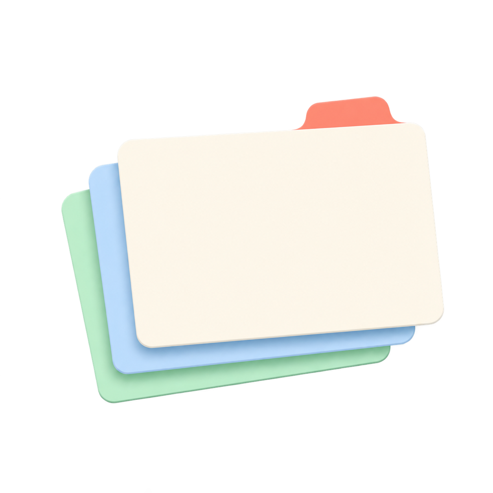

# Snippets documentation

The initial prototype is intentionally small. It provides local CRUD and
keyword retrieval so the interface can be evaluated before richer features,
such as folders, pinned snippets, Markdown, and import/export, are designed.

The app's index-card icon represents a small, personal collection of notes. It
appears in the header and is registered as the JavaFX window icon.
