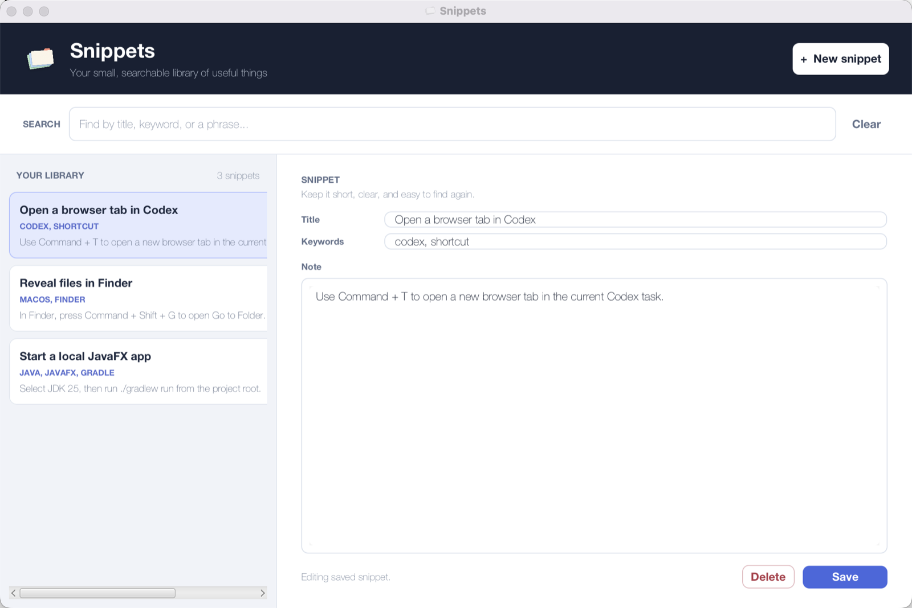

  <header class="snippets-nav">
    <a class="snippets-brand" href="#top">
      
      Snippets
    </a>
    <nav aria-label="Page sections">
      <a href="#how-it-works">How it works</a>
      <a href="#download">Download</a>
      <a href="https://github.com/damithc/snippets">Source</a>
    </nav>
  </header>

  <main id="top">
    <section class="snippets-showcase" aria-labelledby="snippets-title">
      <figure class="snippets-product-shot">
        
        <figcaption>The desktop app, with example snippets.</figcaption>
      </figure>
      

        
Version 0.1.0

        <h1 id="snippets-title">A place for tiny answers.</h1>
        
Keep the shortcut, command, or setup detail that you will need one day but cannot quite remember. Snippets gives it a title, a few keywords, and a home you can search.

        <a class="snippets-download-button" href="https://github.com/damithc/snippets/releases/download/v0.1.0/snippets.jar">Download Snippets.jar</a>
        
Requires Java 25 or later.

      

    </section>

    <section class="snippets-facts" aria-label="What Snippets is for">
      
<strong>Short by design.</strong> Capture a useful detail in a few lines.

      
<strong>Searchable everywhere.</strong> Find words in the title, keywords, or note.

      
<strong>Stored locally.</strong> Your library remains on your computer.

    </section>

    <section class="snippets-workflow" id="how-it-works" aria-labelledby="workflow-title">
      

        
A small loop

        <h2 id="workflow-title">Save the answer while it is still fresh.</h2>
      

      <ol>
        <li>
          01
          

            <h3>Capture the useful bit</h3>
            
Write down the exact step, shortcut, or command that solved the problem. Add the words that future you might remember.

          

        </li>
        <li>
          02
          

            <h3>Search when you need it</h3>
            
Enter a few words. Snippets narrows the library to records containing every one of them, whether they occur in the title, keywords, or note.

          

        </li>
        <li>
          03
          

            <h3>Refine it over time</h3>
            
Edit a note when you learn a better way, or delete it once it stops being useful. The library stays focused on the things you actually use.

          

        </li>
      </ol>
    </section>

    <section class="snippets-download" id="download" aria-labelledby="download-title">
      

        
Ready when you are

        <h2 id="download-title">Download, then run.</h2>
        
Snippets is packaged as one downloadable JAR. You do not need Gradle, IntelliJ IDEA, or the source code to use it.

        <a class="snippets-download-button snippets-download-button--light" href="https://github.com/damithc/snippets/releases/download/v0.1.0/snippets.jar">Get Snippets.jar</a>
        
<a href="https://github.com/damithc/snippets/releases/tag/v0.1.0">View the v0.1.0 release notes</a>

      

      

        
1. Download <code>snippets.jar</code>

        
2. Open a terminal in its folder

        
3. Start the app

        <pre><code>java -jar snippets.jar</code></pre>
      

    </section>

    <section class="snippets-local" aria-labelledby="local-title">
      
      

        <h2 id="local-title">Your notes stay close.</h2>
        
Snippets saves your library in <code>data/snippets.txt</code>, relative to the folder from which you run the JAR. The file is local and ignored by Git, so your personal notes are not added to the project repository.

      

    </section>
  </main>

  <footer>
    
Snippets is an early desktop prototype for remembering the useful little things.

    <a href="https://github.com/damithc/snippets">View the source on GitHub</a>
  </footer>

